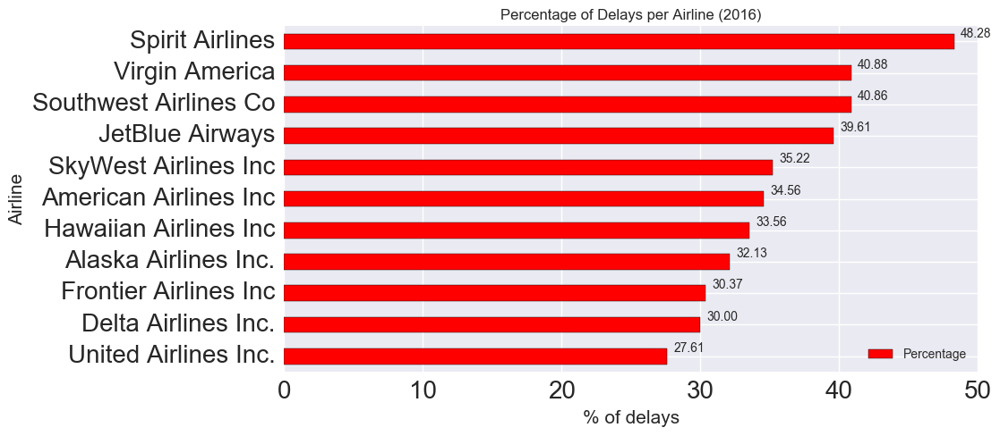

I just came back from a quick get away to Cabo and had a very bad experience with a particular airline. From delays, to horrible customer service, etc. Anyways, I wanted to figure out
with empirical data what airlines perform best with the cities I most frequently travel to, specifically in California. I decided to start some notes. 


```python
import pandas as pd
import numpy as np
import matplotlib.pyplot as plt
import seaborn as sns
%matplotlib inline
import os
```

Downloaded comma-delimited data from the <b>United States Department of Transportation, Bureau of Transportation Statistics website.</b> <br>

This data ranges from the months of <b>January - May in 2016.</b><br>

You can use filters to identify a specific dataset you want to look at.<br>

You can download your own source [here](http://www.transtats.bts.gov/DL_SelectFields.asp?Table_ID=236&DB_Short_Name=On-Time)


```python
# Assign a list of available files in my data directory (../data/2016/) to a variable
files = os.listdir("data/2016");

# Display
files
```


    ['162820111_T_ONTIME-APRIL.csv',
     '162820111_T_ONTIME-FEB.csv',
     '162820111_T_ONTIME-JAN.csv',
     '162820111_T_ONTIME-MARCH.csv',
     '162820111_T_ONTIME-MAY.csv']


```python
# Read through all files and concat all df into a single dataframe, df.
framelist = []

for file in files:
    tempdf = pd.read_csv("data/2016/" + file)
    framelist.append(tempdf)
    
df = pd.concat(framelist);
```

    //anaconda/lib/python3.5/site-packages/IPython/core/interactiveshell.py:2717: DtypeWarning: Columns (14) have mixed types. Specify dtype option on import or set low_memory=False.
      interactivity=interactivity, compiler=compiler, result=result)


Let's look at some basic info with the dataset.


```python
df.info()
```

    <class 'pandas.core.frame.DataFrame'>
    Int64Index: 485856 entries, 0 to 103365
    Data columns (total 22 columns):
    YEAR                     485856 non-null int64
    MONTH                    485856 non-null int64
    UNIQUE_CARRIER           485856 non-null object
    AIRLINE_ID               485856 non-null int64
    ORIGIN_AIRPORT_ID        485856 non-null int64
    ORIGIN_AIRPORT_SEQ_ID    485856 non-null int64
    ORIGIN_CITY_MARKET_ID    485856 non-null int64
    ORIGIN_CITY_NAME         485856 non-null object
    DEST_AIRPORT_ID          485856 non-null int64
    DEST_AIRPORT_SEQ_ID      485856 non-null int64
    DEST_CITY_MARKET_ID      485856 non-null int64
    DEST_CITY_NAME           485856 non-null object
    ARR_DELAY_NEW            479829 non-null float64
    CANCELLED                485856 non-null float64
    CANCELLATION_CODE        5125 non-null object
    AIR_TIME                 479829 non-null float64
    CARRIER_DELAY            85180 non-null float64
    WEATHER_DELAY            85180 non-null float64
    NAS_DELAY                85180 non-null float64
    SECURITY_DELAY           85180 non-null float64
    LATE_AIRCRAFT_DELAY      85180 non-null float64
    Unnamed: 21              0 non-null float64
    dtypes: float64(9), int64(9), object(4)
    memory usage: 85.3+ MB


```python
# Drop the last column in place, 'Unnamed: 21', which is the -1 index
df.drop(df.columns[[-1]], axis=1, inplace=True)
```

Lets see what different airlines we have data for.


```python
df.UNIQUE_CARRIER.unique()
```


    array(['AA', 'AS', 'B6', 'DL', 'F9', 'HA', 'NK', 'OO', 'UA', 'VX', 'WN'], dtype=object)


I retrieved this information from a lookup table from the transtats website, let's assign it to a key/value dict for later use.


```python
airlinekeys = {'AA': 'American Airlines Inc',
               'AS': 'Alaska Airlines Inc.',
               'B6': 'JetBlue Airways',
               'DL': 'Delta Airlines Inc.',
               'F9': 'Frontier Airlines Inc',
               'HA': 'Hawaiian Airlines Inc',
               'NK': 'Spirit Airlines',
               'OO': 'SkyWest Airlines Inc',
               'UA': 'United Airlines Inc.',
               'VX': 'Virgin America',
               'WN': 'Southwest Airlines Co' }

pd.DataFrame.from_dict(airlinekeys, orient="index")
```


<div>
<table border="1" class="dataframe">
  <thead>
    <tr style="text-align: right;">
      <th></th>
      <th>0</th>
    </tr>
  </thead>
  <tbody>
    <tr>
      <th>DL</th>
      <td>Delta Airlines Inc.</td>
    </tr>
    <tr>
      <th>HA</th>
      <td>Hawaiian Airlines Inc</td>
    </tr>
    <tr>
      <th>F9</th>
      <td>Frontier Airlines Inc</td>
    </tr>
    <tr>
      <th>UA</th>
      <td>United Airlines Inc.</td>
    </tr>
    <tr>
      <th>NK</th>
      <td>Spirit Airlines</td>
    </tr>
    <tr>
      <th>OO</th>
      <td>SkyWest Airlines Inc</td>
    </tr>
    <tr>
      <th>AS</th>
      <td>Alaska Airlines Inc.</td>
    </tr>
    <tr>
      <th>B6</th>
      <td>JetBlue Airways</td>
    </tr>
    <tr>
      <th>VX</th>
      <td>Virgin America</td>
    </tr>
    <tr>
      <th>WN</th>
      <td>Southwest Airlines Co</td>
    </tr>
    <tr>
      <th>AA</th>
      <td>American Airlines Inc</td>
    </tr>
  </tbody>
</table>
</div>


### Amount of flights recorded


```python
# Display frequency of each airline recorded.
df['UNIQUE_CARRIER'].value_counts()
```


    WN    138315
    OO     72990
    UA     70824
    AA     67302
    DL     47548
    AS     29289
    VX     24433
    B6     17043
    NK      9736
    F9      4574
    HA      3802
    Name: UNIQUE_CARRIER, dtype: int64


```python
fig = plt.figure(figsize=(20,10))

df.UNIQUE_CARRIER.value_counts().plot(kind='barh')

plt.ylabel('Frequency', fontsize=15); plt.xlabel('Airline', fontsize=15)
plt.tick_params(axis='both', labelsize=15)
plt.title('Flights per Airline (2016)', fontsize=15)
```


    <matplotlib.text.Text at 0x150dd3b38>


### Delay Ratio


```python
# Function to return a dictionary of all delays greater than 0 per carrier

def delayratio(carrier):
    
    carrier = carrier.upper()
    
    total = (df.ix[(df['UNIQUE_CARRIER'] == carrier)]).shape[0]
    delays = (df.ix[(df['UNIQUE_CARRIER'] == carrier ) & (df['ARR_DELAY_NEW'] > 0 )]).shape[0]

    return({ 'Airline': carrier, 'Total': total, 'Delays': delays })
```


```python
carrierlist = list(df.UNIQUE_CARRIER.unique())

print(carrierlist)
```

    ['AA', 'AS', 'B6', 'DL', 'F9', 'HA', 'NK', 'OO', 'UA', 'VX', 'WN']


```python
dflist = []

for val, item in enumerate(carrierlist):
    dflist.append(delayratio(carrierlist[val]))

dflist
```


    [{'Airline': 'AA', 'Delays': 23258, 'Total': 67302},
     {'Airline': 'AS', 'Delays': 9412, 'Total': 29289},
     {'Airline': 'B6', 'Delays': 6750, 'Total': 17043},
     {'Airline': 'DL', 'Delays': 14263, 'Total': 47548},
     {'Airline': 'F9', 'Delays': 1389, 'Total': 4574},
     {'Airline': 'HA', 'Delays': 1276, 'Total': 3802},
     {'Airline': 'NK', 'Delays': 4701, 'Total': 9736},
     {'Airline': 'OO', 'Delays': 25704, 'Total': 72990},
     {'Airline': 'UA', 'Delays': 19553, 'Total': 70824},
     {'Airline': 'VX', 'Delays': 9989, 'Total': 24433},
     {'Airline': 'WN', 'Delays': 56518, 'Total': 138315}]


```python
# Let's put the list of dicts into a dataframe
delayratiodf = pd.DataFrame(dflist)

# Let's set the index of the dataframe to be 'Airline'
delayratiodf.set_index('Airline', inplace=True)

# Let's use the airlinekey dictionary we made earlier to replace the airline codenames
delayratiodf.rename(index=airlinekeys, inplace=True)
```


```python
delayratiodf
```


<div>
<table border="1" class="dataframe">
  <thead>
    <tr style="text-align: right;">
      <th></th>
      <th>Delays</th>
      <th>Total</th>
    </tr>
    <tr>
      <th>Airline</th>
      <th></th>
      <th></th>
    </tr>
  </thead>
  <tbody>
    <tr>
      <th>American Airlines Inc</th>
      <td>23258</td>
      <td>67302</td>
    </tr>
    <tr>
      <th>Alaska Airlines Inc.</th>
      <td>9412</td>
      <td>29289</td>
    </tr>
    <tr>
      <th>JetBlue Airways</th>
      <td>6750</td>
      <td>17043</td>
    </tr>
    <tr>
      <th>Delta Airlines Inc.</th>
      <td>14263</td>
      <td>47548</td>
    </tr>
    <tr>
      <th>Frontier Airlines Inc</th>
      <td>1389</td>
      <td>4574</td>
    </tr>
    <tr>
      <th>Hawaiian Airlines Inc</th>
      <td>1276</td>
      <td>3802</td>
    </tr>
    <tr>
      <th>Spirit Airlines</th>
      <td>4701</td>
      <td>9736</td>
    </tr>
    <tr>
      <th>SkyWest Airlines Inc</th>
      <td>25704</td>
      <td>72990</td>
    </tr>
    <tr>
      <th>United Airlines Inc.</th>
      <td>19553</td>
      <td>70824</td>
    </tr>
    <tr>
      <th>Virgin America</th>
      <td>9989</td>
      <td>24433</td>
    </tr>
    <tr>
      <th>Southwest Airlines Co</th>
      <td>56518</td>
      <td>138315</td>
    </tr>
  </tbody>
</table>
</div>


```python
# Lets sort by total flights
delayratiodf.sort_values('Total', inplace=True)

# Create a stacked barchart
plot = delayratiodf[['Delays', 'Total']].plot(kind='barh', figsize=(20,15), legend=True, fontsize=20, color=['r', 'b'])

# Increase the legend size
plot.legend(loc=4, prop={'size':20})
```


    <matplotlib.legend.Legend at 0x1408624e0>


### Percentage of Delays


```python
# Simple function to determine ratio
def ratio(df):
    return float("%.2f" % ((df[0]/df[1])*100))
```


```python
# Create a new column 'Percentage', and apply the function 'ratio' to the data.
delayratiodf['Percentage'] = delayratiodf.apply(ratio, axis=1)

# Sort values again by percentage
delayratiodf.sort_values('Percentage', inplace=True)
```


```python
delayratiodf
```


<div>
<table border="1" class="dataframe">
  <thead>
    <tr style="text-align: right;">
      <th></th>
      <th>Delays</th>
      <th>Total</th>
      <th>Percentage</th>
    </tr>
    <tr>
      <th>Airline</th>
      <th></th>
      <th></th>
      <th></th>
    </tr>
  </thead>
  <tbody>
    <tr>
      <th>United Airlines Inc.</th>
      <td>19553</td>
      <td>70824</td>
      <td>27.61</td>
    </tr>
    <tr>
      <th>Delta Airlines Inc.</th>
      <td>14263</td>
      <td>47548</td>
      <td>30.00</td>
    </tr>
    <tr>
      <th>Frontier Airlines Inc</th>
      <td>1389</td>
      <td>4574</td>
      <td>30.37</td>
    </tr>
    <tr>
      <th>Alaska Airlines Inc.</th>
      <td>9412</td>
      <td>29289</td>
      <td>32.13</td>
    </tr>
    <tr>
      <th>Hawaiian Airlines Inc</th>
      <td>1276</td>
      <td>3802</td>
      <td>33.56</td>
    </tr>
    <tr>
      <th>American Airlines Inc</th>
      <td>23258</td>
      <td>67302</td>
      <td>34.56</td>
    </tr>
    <tr>
      <th>SkyWest Airlines Inc</th>
      <td>25704</td>
      <td>72990</td>
      <td>35.22</td>
    </tr>
    <tr>
      <th>JetBlue Airways</th>
      <td>6750</td>
      <td>17043</td>
      <td>39.61</td>
    </tr>
    <tr>
      <th>Southwest Airlines Co</th>
      <td>56518</td>
      <td>138315</td>
      <td>40.86</td>
    </tr>
    <tr>
      <th>Virgin America</th>
      <td>9989</td>
      <td>24433</td>
      <td>40.88</td>
    </tr>
    <tr>
      <th>Spirit Airlines</th>
      <td>4701</td>
      <td>9736</td>
      <td>48.28</td>
    </tr>
  </tbody>
</table>
</div>


```python
ax = delayratiodf.plot(y='Percentage', kind='barh', figsize=(10,5), title='% of delayed flights', color='red')

plt.ylabel('Percentage', fontsize=15); plt.xlabel('Airline', fontsize=20)
plt.tick_params(axis='both', labelsize=20)

for p in ax.patches:
    ax.annotate("%.2f" % p.get_width(), (p.get_x() + p.get_width(), p.get_y()), xytext=(5, 10), textcoords='offset points')
```





## California Specific Analysis


```python
# Create new dataframe with origin/dest related to CA
cali_df = df[(df['ORIGIN_CITY_NAME'].str.endswith('CA')) & (df['DEST_CITY_NAME'].str.endswith('CA'))]
```


```python
plot = cali_df.UNIQUE_CARRIER.value_counts().plot(kind='barh', title='Flights per Airline')
```


```python
ax = sns.barplot(orient='v', x='UNIQUE_CARRIER', y='ARR_DELAY_NEW', data=cali_df)
ax.set_title('Average delay by airline')
```


    <matplotlib.text.Text at 0x1535b3cf8>


```python
# Dummy variables for all the categorical features.
dummy_df = pd.get_dummies(cali_df).copy()
```


```python
# Replace numeric missing values (NaNs) with the mean of their respective columns
dummy_df = dummy_df.fillna(dummy_df.mean())
```


```python
# Set up matrices to use for sklearn
X = dummy_df.drop('AIR_TIME', 1).values
y = dummy_df['AIR_TIME'].values
```

### Modeling
##### (In progress, predicting air_time)


```python
from sklearn.preprocessing import PolynomialFeatures
from sklearn.linear_model import LinearRegression
from sklearn.model_selection import train_test_split
from sklearn.preprocessing import PolynomialFeatures
import numpy as np


X_train, X_test, y_train, y_test = train_test_split(X, y, test_size=0.1, random_state=1)


from sklearn.ensemble import RandomForestRegressor
from sklearn.metrics import r2_score
from sklearn.metrics import mean_squared_error
from sklearn.ensemble import AdaBoostRegressor
from sklearn.linear_model import Ridge, Lasso
from sklearn.ensemble import GradientBoostingRegressor
from sklearn import linear_model
from sklearn.tree import DecisionTreeRegressor
from sklearn.ensemble import ExtraTreesRegressor
from sklearn.neural_network import MLPRegressor

params = {'n_estimators': 1000, 'max_depth': 4.5, 'min_samples_split': 2,
          'learning_rate': 0.01, 'loss': 'ls'}


forest = ExtraTreesRegressor(criterion='mse', random_state=1)
#forest = GradientBoostingRegressor(**params)
#forest = RandomForestRegressor(n_estimators=1000, bootstrap=False, max_depth=None, criterion='mae', verbose=False, random_state=1, n_jobs=-1)
#forest = AdaBoostRegressor(DecisionTreeRegressor(criterion='mse'), n_estimators=1000, random_state=1)
#forest = Ridge(alpha=1, normalize=True, fit_intercept=False, random_state=1)
#forest = linear_model.SGDRegressor(penalty='elasticnet')
#forest = DecisionTreeRegressor(criterion='mse')
#forest = Ridge(alpha=0.0001, random_state=1)
#forest = MLPRegressor(activation='logistic',
#                      solver='lbfgs',learning_rate='adaptive')

forest.fit(X_train, y_train)

y_train_pred = forest.predict(X_train)
y_test_pred = forest.predict(X_test)

print('MSE train: %.3f, test: %.3f' % (
      mean_squared_error(y_train, y_train_pred),
      mean_squared_error(y_test, y_test_pred)))

print('R^2 train: %.3f, test: %.3f' %(
      r2_score(y_train, y_train_pred),
      r2_score(y_test, y_test_pred)))

plt.scatter(y_train_pred, y_train_pred - y_train, c='black', marker='o', s=35, alpha=0.5, label='Training Data')
plt.scatter(y_test_pred, y_test_pred - y_test, c='lightgreen', marker='s', s=35, alpha=0.7, label='Test data')

plt.xlabel('Predicted values')
plt.ylabel('Error/Residuals')
plt.legend(loc='upper left')
plt.hlines(y=0, xmin=-10, xmax=5, lw=2, color='red')
#plt.xlim([-1, 2])
#plt.ylim([-0.5, 1])
plt.show()
```

    MSE train: 7.502, test: 15.512
    R^2 train: 0.947, test: 0.890


