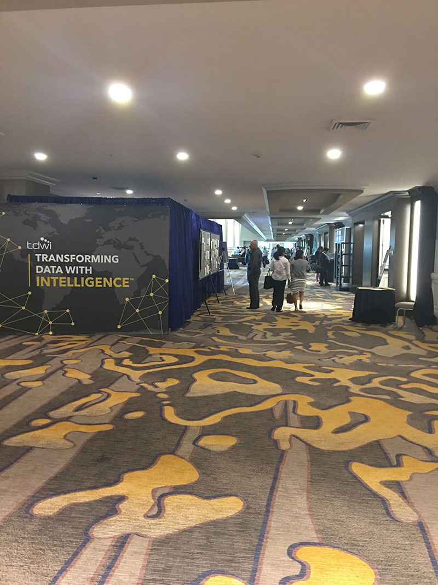
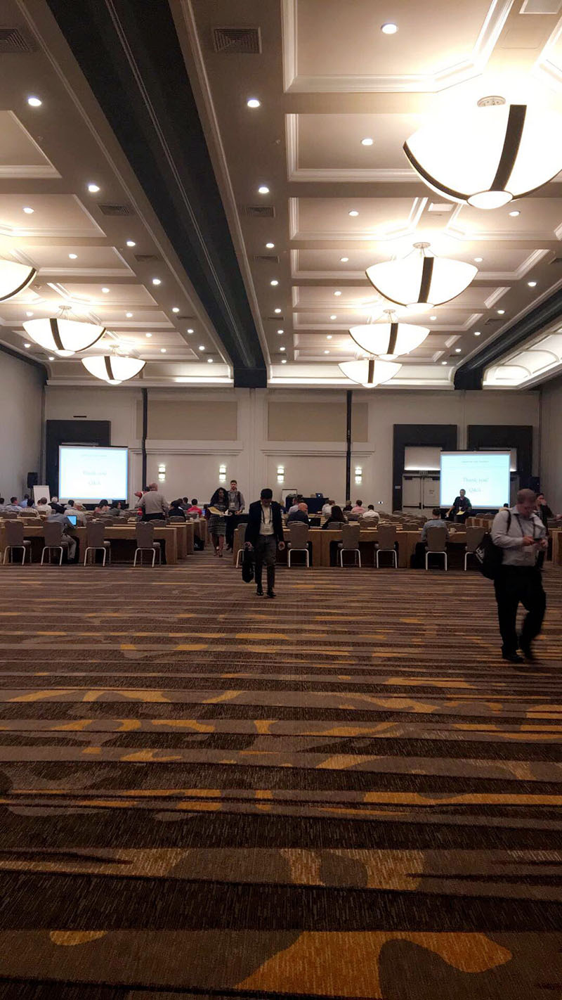
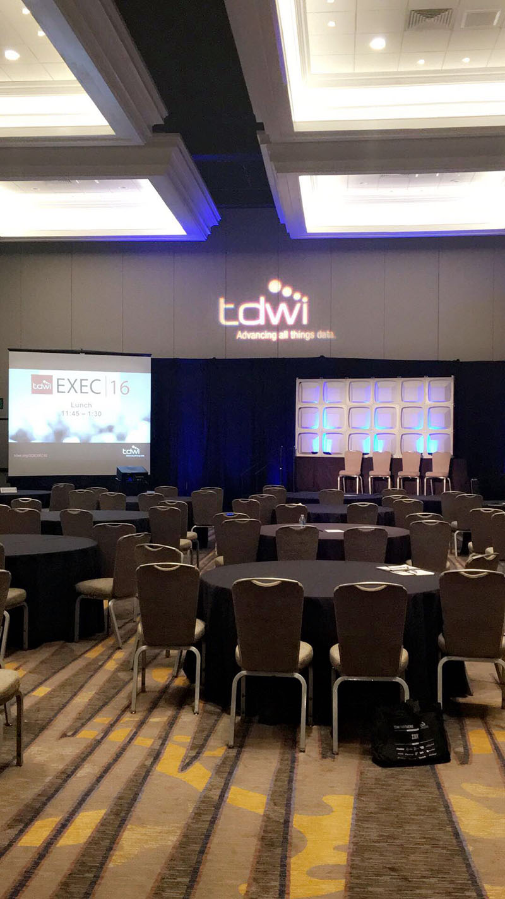
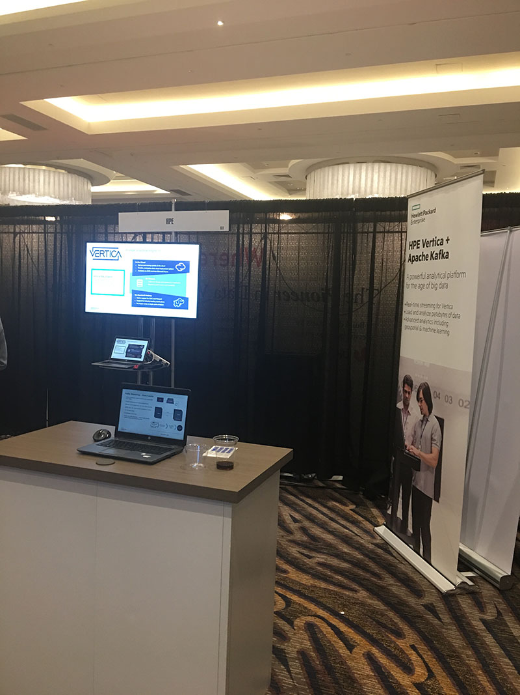

> The Industry's Leading Analytics and Data Management Conference.
 
I decided to attend the TDWI hosted event in San Diego, CA. The event consisted of numerous classes and key-note presentations around Big Data, focusing on various aspects from Data mining, machine learning, big data, business intelligence, and more. 
 
I attended the 2-day bootcamp around the fundamentals of Data Science, which started off the week. I had the wonderful opportunity to meet with some industry leaders and professionals that work in this field to get their perspective on building a data science team and deep dive into the aspects of CRISP-DM.

Overall, the event was well organized and informational. I recommend it to anyone looking to gain insights in the fields of BI and Data science and how to derive value from data for the business.

For more formation on the event, [https://events.tdwi.org/events/san-diego-2016/home.aspx](https://events.tdwi.org/events/san-diego-2016/home.aspx)

--- 

##### Events attended

**Day 1**  
Big Data Fundamentals: Creating Value from Nontraditional Data Sets  
Speaker: Mark Peco

**Day 2**  
Data Science Bootcamp, an Overview of Data Science  
Speaker: Dean Abbott

Data Science Bootcamp, Data Sourcing and Preparation for Data Science  
Speaker: William Henry

**Day 3**  
Data Science Bootcamp, Modeling Your Data: Building Models  
Speaker: Natasha Balac

Data Science Bootcamp, Data Science in the Enterprise  
Speakers: John Akred, Jeffrey Yau, Cindi Thompson (SVDS)

**Day 4**  
Trend Spotting and Pattern Spotting: Seeing What Matters in Data Visualizations  
Speaker: Dave Wells

Data Storage Technologies: From Hadoop to Graph Databases, NoSQL to NewSQL  
Speaker: Rick van der Lans  

**Day 5**  
Data Preparation for Predictive Analytics  
Speaker: Keith McCormick  

---

##### Images

    
    
    
    
    
    
    

